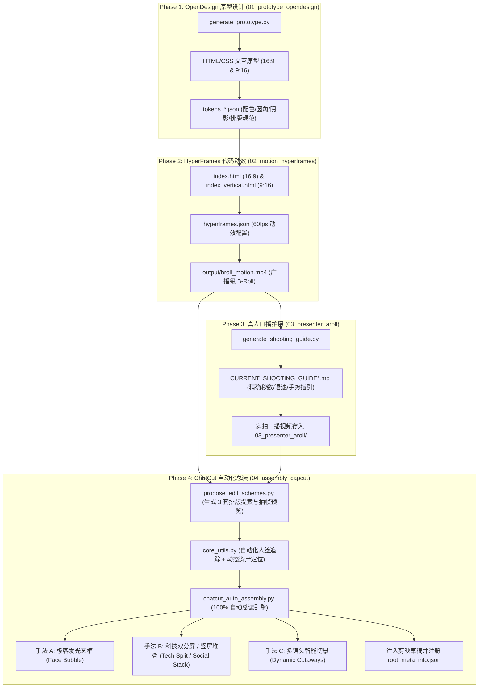

# 📑 HyperPresenter Studio - 系统架构与设计文档 (System Architecture)

本文档客观陈述 `hyper-presenter-studio` 的系统全景设计、模块职责切分与底层技术实现。

---

## 一、 系统定位与设计哲学 (Design Philosophy)

本项目定位为**人机协同极客短视频工业化工作流**（面向开源项目、CLI工具、SaaS、API 等技术场景）。

针对传统制作中“纯真人口播太枯燥”与“纯代码逐帧微调视频太累”的矛盾，系统采用**“四权分立，各司其职”**的解耦架构：
- **OpenDesign** 负责**视觉基调与布局**（高精度 UI 原型、暗黑科技配色 Tokens、跨端自适应布局）；
- **HyperFrames** 负责**灵魂动效**（真实键盘打字节奏、终端扫描线、3D 视差推拉、无损 60fps 渲染）；
- **真人创作者** 负责**温度与可信度**（眼神交流、观点表达、情绪感染力、视线与手势指引）；
- **ChatCut / 剪映自动化** 负责**总装与自适应融合**（实时人脸平滑追踪重定帧、双轨对齐、自动索引注册剪映桌面端草稿）。

---

## 二、 系统架构与模块分工 (System Architecture)



---

## 三、 核心技术实现与算法 (Technical Implementations)

### 1. 全自动实时人脸追踪与平滑重定帧 (Real-Time EMA Face Tracking Engine)
- **挑战**：传统固定框裁剪在口播者微动或手势变化时，容易导致人脸偏移或被边缘切割；硬编码关键帧则缺乏泛化性。
- **算法设计**（位于 `04_assembly_capcut/core_utils.py`）：
  1. **双模态智能检测**：优先采用 OpenCV Haar Cascade 级联分类器检测人脸中心；若侧脸或低照度漏检，自动回退至人体 YCrCb 肤色聚类质心算法（Skin Color Centroid Heuristic）；
  2. **EMA 指数移动平均平滑滤波**：
     $$\text{ema}_t = \alpha \cdot \text{target}_t + (1 - \alpha) \cdot \text{ema}_{t-1} \quad (\alpha = 0.18)$$
     消除离散帧跳跃，使镜头运动如物理滑轨般平滑丝滑；
  3. **边缘智能夹紧 (Boundary Clamping)**：动态保证 490×490 裁剪视窗始终严格处于视频物理边界内部，杜绝黑边与越界崩溃；
  4. **尾帧定格自适应 (Freeze-Frame Hold)**：当真人素材时长短于 B-Roll 时，自动定格最后一帧微笑画面，避免帧跳回第 0 帧。

### 2. 横屏 (16:9) 与竖屏 (9:16) 双画幅工业化支持 (Dual Aspect Ratio Architecture)
- **横屏 (16:9 / 1920×1080)**：
  - **Bubble 模式**：440×440 圆框居于右下角 (`1420, 580`)，外沿环绕 `#38bdf8` 霓虹能量环；
  - **Split 模式**：左侧 1200×675 演示窗口 + 右侧 544×960 真人立绘；
  - **Dynamic 模式**：Shot 1 (0-2.5s) 全屏居中真人 ➔ Shot 2 (2.5-7.5s) 全屏演示+圆框 ➔ Shot 3 (7.5-10s) 双分屏收尾。
- **竖屏 (9:16 / 1080×1920)**：
  - **Bubble 模式**：360×360 紧凑气泡，定位在底部安全区上方 (`680, 1340`)，避开平台点赞与评论按钮；
  - **Social Stack 模式**：上半屏 1000×562 浮动终端卡片 + 下半屏 1080×1080 真人口播半身，完美契合短视频受众注意力；
  - **Dynamic 模式**：Shot 1 (0-2.5s) 竖屏人像 Hook ➔ Shot 2 (2.5-7.5s) 移动端发光圆框 ➔ Shot 3 (7.5-10s) 上下堆叠收尾。

### 3. 剪映 / CapCut 桌面端自动草稿注入与索引注册 (Draft Indexing)
- 自动嗅探操作系统默认草稿根目录（Windows: `AppData/Local/JianyingPro/`，macOS: `Movies/JianyingPro/`）；
- 构建 `draft_meta_info.json` 与 `draft_content.json`，多轨道、时间戳与 Transform 几何坐标预置就绪；
- **全自动更新 `root_meta_info.json` 索引库**：使得生成的草稿立即可见于剪映桌面端“最近项目”首位。

---

## 四、 仓库目录规范 (Directory Layout)

```text
hyper-presenter-studio/
├── 01_prototype_opendesign/          # 【阶段一】OpenDesign 原型生成
│   ├── generate_prototype.py         # 原型与 Token 自动化生成脚本 (16:9 & 9:16)
│   ├── prototype_cyber-dark.html     # 赛博暗黑主题 (横屏 1920x1080)
│   ├── prototype_cyber-dark_9x16.html# 赛博暗黑主题 (竖屏 1080x1920 移动端卡片)
│   ├── prototype_matrix-neon.html    # 极客骇客绿主题
│   ├── prototype_cyber-purple.html   # 赛博霓虹紫主题
│   └── tokens/                       # 导出的 JSON 设计 Token
│
├── 02_motion_hyperframes/            # 【阶段二】HyperFrames 代码动效
│   ├── index.html                    # 横屏 16:9 动效工程 (逐字打字机)
│   ├── index_vertical.html           # 竖屏 9:16 移动端动效工程
│   └── hyperframes.json              # 动效工程配置
│
├── 03_presenter_aroll/               # 【阶段三】真人口播摄制
│   ├── generate_shooting_guide.py    # 专属拍摄指南与提词卡生成器
│   ├── CURRENT_SHOOTING_GUIDE.md     # 横屏拍摄指南 (向左前方指引)
│   └── CURRENT_SHOOTING_GUIDE_9x16.md# 竖屏拍摄指南 (向上指引/平台安全区)
│
├── 04_assembly_capcut/               # 【阶段四】ChatCut 自动化总装
│   ├── core_utils.py                 # 底层工具库：人脸平滑跟踪、动态资产定位、剪映索引注册
│   ├── propose_edit_schemes.py       # 剪辑提案与 Demo 抽帧预览生成器 (双画幅)
│   └── chatcut_auto_assembly.py      # 100% 自动总装引擎 (Bubble / Split / Dynamic)
│
├── assets/                           # 永久视效资产库
│   ├── circle_ring.png               # 赛博青 #38bdf8 霓虹能量光环
│   └── circle_mask.png               # 极客抗锯齿圆形蒙版
│
├── output/                           # 产出交付库
│   ├── broll_motion.mp4              # HyperFrames 渲染的标准 B-Roll 视频
│   ├── EDITING_PROPOSAL.md           # 16:9 剪辑提案审查报告
│   ├── EDITING_PROPOSAL_9X16.md      # 9:16 剪辑提案审查报告
│   ├── face_bubble_optimized_1920x1080.mp4
│   ├── split_presenter_1920x1080.mp4
│   ├── dynamic_cutaways_1920x1080.mp4
│   ├── face_bubble_optimized_1080x1920_vertical.mp4
│   ├── split_presenter_1080x1920_vertical.mp4
│   └── dynamic_cutaways_1080x1920_vertical.mp4
│
├── WORKFLOW_SOP.md                   # 4 阶段全流程标准作业程序 (SOP)
├── ARCHITECTURE.md                   # 本技术架构文档
├── REVIEW.md                         # 架构盲审报告与修复追踪
├── requirements.txt                  # Python 依赖清单
├── package.json                      # 统一 npm scripts 入口
└── LICENSE                           # MIT License
```
