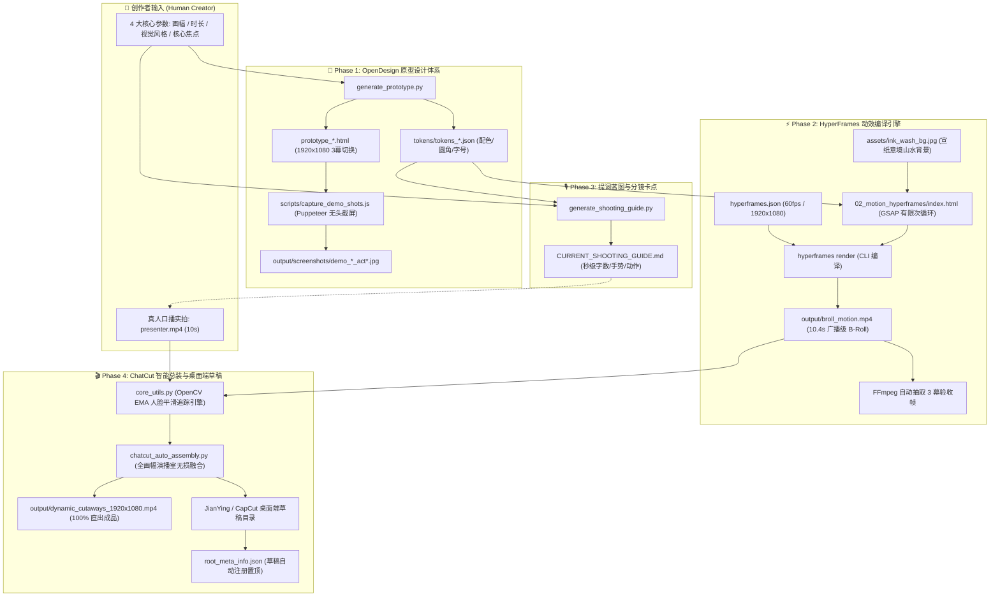

# 🧠 HyperPresenter Studio - 项目核心知识图谱 (Project Knowledge Graph)

> **版本**：`v1.2.0-industrial`  
> **文档目的**：建立跨会话、跨智能体、跨开发者的高保真知识实体网络（Knowledge Graph），收敛核心拓扑、契约约束、算法数学模型与避坑法则。

---

## 🗺️ 一、 系统全景拓扑与数据流图谱 (System Topology & Data Flow)



---

## 🔄 二、 五阶人机协同导演状态机 (Director State Machine)

智能体在协助用户制作视频时，**必须严格作为有限状态机运行**，状态流转契约如下：

```mermaid
stateDiagram-v2
    [*] --> STATE_0_INTAKE: 用户提出视频制作需求
    
    state STATE_0_INTAKE {
        [*] --> Ask4Params: 调研画幅/时长/风格/演示焦点
        Ask4Params --> WaitUserAnswer: 等待用户输入偏好
    }

    STATE_0_INTAKE --> STATE_1_PROPOSAL: 用户提供偏好
    
    state STATE_1_PROPOSAL {
        [*] --> MakeProposal: 制定三幕分镜 + Tokens + 演播室无损融合
        MakeProposal --> Checkpoint1: 呈递方案
        Checkpoint1 --> WaitSignOff1: ⏸️ 阻塞等待
    }

    STATE_1_PROPOSAL --> STATE_2_DEMO_REVIEW: 明确回复【确认方案】
    
    state STATE_2_DEMO_REVIEW {
        [*] --> GenPrototype: 生成 HTML 原型
        GenPrototype --> PuppeteerCapture: 自动截屏 3 幕 1080P 实拍图
        PuppeteerCapture --> EmbedInChat: 📸 将实拍图直接贴入对话
        EmbedInChat --> Checkpoint2: 呈递走查
        Checkpoint2 --> WaitSignOff2: ⏸️ 阻塞等待
    }

    STATE_2_DEMO_REVIEW --> STATE_2_DEMO_REVIEW: 提出修改意见 (调字号/换背景)
    STATE_2_DEMO_REVIEW --> STATE_3_RENDER_BROLL: 明确回复【确认 Demo / 下一步】

    state STATE_3_RENDER_BROLL {
        [*] --> HyperFramesCompile: 编译 1080P 60FPS MP4
        HyperFramesCompile --> FFmpegExtract: 抽取 3 幕成片帧呈递验收
    }

    STATE_3_RENDER_BROLL --> STATE_4_GUIDE_ASSEMBLY: 验收通过

    state STATE_4_GUIDE_ASSEMBLY {
        [*] --> GenGuide: 生成专属拍摄指南
        GenGuide --> WaitFootage: 等待放入 presenter.mp4 (或 --restore-demo)
        WaitFootage --> ChatCutAssembly: OpenCV EMA 人脸追踪居中
        ChatCutAssembly --> DraftInjection: 直出成品 + 注入剪映草稿置顶
    }

    STATE_4_GUIDE_ASSEMBLY --> [*]: 交付成片
```



---

## 🛡️ 三、 工业化工程红线与避坑矩阵 (Engineering Red Lines Matrix)

| 维度 | 常见致命陷阱 (Pitfall) | 系统化解决方案 (Solution) | 关联代码/契约 |
| :--- | :--- | :--- | :--- |
| **交互协同** | 盲目直接开工、默认给写死模版、未经拍板擅自渲染 | **前置问诊 4 参数**；严格设立“确认方案”与“确认 Demo”两道阻断 Checkpoints | [WORKFLOW_SOP.md](file:///d:/video/视频3/hyper-presenter-studio/WORKFLOW_SOP.md), [SKILL.md](file:///d:/video/视频3/hyper-presenter-studio/SKILL.md) |
| **视觉呈现** | 仅给网页链接让用户脑补；成片左右分屏导致左边内容缩小看不清 | **Puppeteer 自动截屏嵌入对话**；采用**全画幅演播室无损融合**（左侧 100% 原始大小 + 76px 磅礴大字，右侧人像光环融入） | `scripts/capture_demo_shots.js`, `tokens_ink-wash.json` |
| **动效稳定性** | GSAP 使用 `repeat: -1` 导致 HyperFrames 探测出 `10000000000s` 崩溃 | **禁用无限循环**，计算精确持续时间，使用有限循环（如 `repeat: 1` 配合 5s 动画刚好覆盖 10s） | `02_motion_hyperframes/index.html` |
| **编译器隔离** | 同一动效目录下放置横屏 `index.html` 与竖屏 `index_vertical.html` 导致画幅混淆 | **单一 Root 契约**：根层级仅保留 `index.html`，备用模板严格隔离在 `templates/` 子目录 | `02_motion_hyperframes/templates/` |
| **人脸追踪** | 固定框裁切导致人脸偏移出画；真人素材较短导致末尾黑屏会跳 | **OpenCV Haar + YCrCb 质心双模态检测** + EMA 平滑滤波 ($\alpha=0.18$) + 边界夹紧 + 最后一帧定格微笑 | `04_assembly_capcut/core_utils.py` |
| **剪映集成** | 仅生成草稿目录，剪映“最近项目”不显示，需要用户手动导入 | **修改并重写 `root_meta_info.json`**，直接插入当前项目 draft ID 并刷新时间戳，实现桌面端打开即置顶 | `core_utils.register_jianying_draft_index()` |
| **Windows 文件锁** | FFmpeg 进程释放延迟或多任务同时访问临时文件报 `PermissionError: [WinError 32]` | **实现 `safe_unlink` 带重试机制**，通过小步延时重试安全解除句柄，避免中断流水线 | `chatcut_auto_assembly.py:safe_unlink()` |

---

## 🎨 四、 视觉设计体系与 Tokens 映射 (Design Tokens Taxonomy)

```text
Visual Theme Tokens Architecture:
├── ink-wash (现代新中式宣白水墨风) ★ 经典水墨推荐
│   ├── bg: #fbfbfa (宣纸宣白) + assets/ink_wash_bg.jpg (意境山水)
│   ├── typography: 76px+ Ma Shan Zheng (毛笔书法) + Noto Serif SC 900
│   ├── accents: #dc2626 (朱砂印泥红) + #d97706 (琥珀金) + #18181b (浓墨黑)
│   └── aura: 朱砂红光晕环 + 琥珀金高光线 (circle_ring_ink-wash.png)
│
├── ai-coach (杂志手账折页风) ★ 业务培训/营销推荐
│   ├── bg: #faf7ee (暖米白宣纸) + 手账方格与折页纹理
│   ├── typography: 72px+ 澎湃黑体/手账标题 + 荧光马克笔重点标注
│   ├── accents: #ea580c (复古砖橙) + #f59e0b (琥珀暖金) + #ef4444 (警示红)
│   └── aura: 暖金外晕 + 砖橙内实环 + 荧光亮金高光 (circle_ring_ai-coach.png)
│
├── prismatic-aurora (极光五彩绚烂风)
│   ├── bg: #11092a (深紫夜幕) + 弥散流光
│   ├── accents: #38bdf8 (天蓝) + #f472b6 (洋红) + #fbbf24 (暖金)
│   └── aura: 天蓝流光双环
│
├── cyber-dark (赛博青暗黑极客风)
│   ├── bg: #050811 (太空深蓝) + 经纬科技网
│   └── accents: #38bdf8 (冰蓝高亮) + #34d399 (翡翠绿)
│
├── matrix-neon (极客骇客绿)
│   └── accents: #10b981 (荧光翠绿) + #a7f3d0 (浅绿高光)
│
└── cyber-purple (赛博霓虹紫)
    └── accents: #c084fc (霓虹紫) + #f472b6 (荧光粉)
```

---

## 📐 五、 OpenCV EMA 人脸平滑重定帧数学模型 (Mathematical Model)

在人像居中裁切过程中，采用离散质心检测配合指数移动平均（EMA）平滑模型，实现平滑滑轨视觉体验：

$$
\text{target}_t = 
\begin{cases} 
(c_{x}, c_{y})_{\text{Haar}}, & \text{if face detected} \\
(c_{x}, c_{y})_{\text{YCrCb}}, & \text{if skin cluster centroid valid} \\
(0.50 \cdot W, 0.45 \cdot H), & \text{fallback (golden eye level)}
\end{cases}
$$

$$
\text{pos}_t = \alpha \cdot \text{target}_t + (1 - \alpha) \cdot \text{pos}_{t-1} \quad (\alpha = 0.18)
$$

视窗边界安全夹紧约束：
$$
x_{\text{crop}} = \max\left(0, \min\left(W - S_{\text{crop}}, \text{pos}_{x} - \frac{S_{\text{crop}}}{2}\right)\right)
$$
$$
y_{\text{crop}} = \max\left(0, \min\left(H - S_{\text{crop}}, \text{pos}_{y} - \frac{S_{\text{crop}}}{2}\right)\right)
$$

圆环与 Alpha 遮罩三轨复合：
$$
I_{\text{bubble}} = I_{\text{roi}} \odot (1 - M) + I_{\text{crop}} \odot M
$$
$$
I_{\text{final}} = I_{\text{bubble}} \odot (1 - A_{\text{ring}}) + I_{\text{ring}} \odot A_{\text{ring}}
$$

---

## 💻 六、 依赖栈与工具矩阵 (Toolchain & Dependencies)

- **运行时环境**：Node.js $\ge 20.0$, Python $\ge 3.10$, Windows / macOS
- **核心 CLI 工具**：
  - `hyperframes@0.8.70` (代码驱动 60FPS 视频渲染)
  - `puppeteer-core` (无头浏览器实拍图截取)
  - `ffmpeg` (音视频无损流切分、抽帧与重封装)
- **Python 核心计算依赖** (`requirements.txt`)：
  - `opencv-python` ($\ge 4.8.0$)
  - `numpy` ($\ge 1.24.0$)
  - `pillow` ($\ge 10.0.0$)
- **桌面剪辑宿主**：
  - 剪映专业版 (JianYing Pro) / CapCut Desktop
