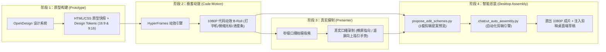

# ⚡ HyperPresenter Studio

<p align="center">
  <b>Next-Gen Human-AI Hybrid Video Studio: From OpenDesign Prototypes to HyperFrames Code Motion & CapCut Desktop Assembly.</b>
  <br />
  下一代人机协同极客视频工坊：从 OpenDesign 原型设计，到 HyperFrames 代码动效渲染，再到剪映 / CapCut 桌面端智能自动化总装。
</p>

<p align="center">
  
  
  
  
  
  
</p>

---

## 📖 一、 为什么要做这个项目？ (The Problem & The Solution)

现代开发者、科技博主与技术布道师在制作“科技感口播 / 开发者工具视频（如 CLI、SaaS、API）”时，普遍面临两大致命困境：

1. **纯真人口播太枯燥**：对着镜头干讲超过 3 秒，观众就容易审美疲劳；市面上的贴纸、五毛特效又极具塑料感，缺乏真正的极客高级感。
2. **纯代码动画太累赘**：用代码写视频（如 Remotion / HyperFrames）虽然动效惊艳，但一旦试图用代码去剪辑真实人类视频（切除气口、微调表情、对齐音频波形），修改一次需要反复重新编译渲染，如同“用卡尺去量云朵”，效率极其低下。

### 💡 核心破局思路：四权分立，各司其职 (The 4-Pillar Architecture)

我们彻底将视频生产链路拆解为**确定性工具**与**人类创意**的最佳咬合模式，并全面打通**横屏 16:9 与竖屏 9:16 双画幅工业化支持**：



- **OpenDesign**：负责**颜值与布局**（高精度 UI/UX 原型、暗黑/骇客/霓虹配色方案、跨端自适应布局）；
- **HyperFrames**：负责**灵魂动效**（真实键盘逐字打字节奏、终端扫描线、3D 视差推拉、无损 60fps 渲染）；
- **真人出镜**：负责**温度与信赖感**（A-Roll 真实面孔、观点表达、情绪感染力、视线与手势引导）；
- **ChatCut / 剪映桌面端**：负责**智能总装**（自动人脸追踪居中重定帧、双轨对齐、预置剪映草稿工程，零人工拖拽）。

---

## 📂 二、 仓库目录规范 (Repository Layout)

```text
hyper-presenter-studio/
├── 01_prototype_opendesign/          # 第一阶段：OpenDesign 原型沉淀区
│   ├── generate_prototype.py         # 原型与 Token 自动化生成脚本 (支持 16:9 & 9:16)
│   ├── prototype_ink-wash.html       # 现代新中式宣白水墨风 (1920x1080 毛笔大字)
│   ├── prototype_prismatic-aurora.html# 五彩极光流光主题
│   ├── prototype_cyber-dark.html     # 赛博暗黑主题
│   ├── prototype_matrix-neon.html    # 极客骇客绿主题
│   ├── prototype_cyber-purple.html   # 赛博霓虹紫主题
│   └── tokens/                       # 导出的 JSON 设计 Token (配色/排版/圆角)
│
├── 02_motion_hyperframes/            # 第二阶段：HyperFrames 代码动效工程
│   ├── index.html                    # 横屏 16:9 动效工程入口 (GSAP 逐字打字机)
│   ├── hyperframes.json              # 动效工程配置
│   ├── package.json                  # HyperFrames 局部依赖
│   ├── assets/                       # 局部视效资产 (ink_wash_bg.jpg 等)
│   └── templates/                    # 竖屏备用模板 (index_vertical.html 隔离区)
│
├── 03_presenter_aroll/               # 第三阶段：真人口播摄制指南
│   ├── generate_shooting_guide.py    # 专属拍摄指南与提词卡生成器
│   ├── CURRENT_SHOOTING_GUIDE.md     # 横屏 16:9 秒级分镜卡点指南
│   └── CURRENT_SHOOTING_GUIDE_9x16.md# 竖屏 9:16 移动端卡点指南
│
├── 04_assembly_capcut/               # 第四阶段：ChatCut 自动化总装引擎
│   ├── core_utils.py                 # 底层工具库：人脸平滑跟踪、动态资产嗅探、剪映索引注册
│   ├── propose_edit_schemes.py       # 剪辑提案与 Demo 抽帧预览生成器 (双画幅)
│   └── chatcut_auto_assembly.py      # 100% 自动总装引擎 (Bubble / Split / Dynamic)
│
├── assets/                           # 永久视效资产库 (ink_wash_bg.jpg, circle_ring.png 等)
├── scripts/                          # 工程化自动化脚本
│   └── capture_demo_shots.js         # 原型 Demo 三幕高清实拍图自动捕获工具 (Puppeteer)
├── output/                           # 成品出片与提案审查库
│   ├── broll_motion.mp4              # HyperFrames 渲染的标准 1080P B-Roll 视频
│   ├── screenshots/                  # 走查实拍图与成片抽帧帧库
│   └── *.mp4                         # 自动总装生成的交付视频
│
├── templates/                        # 开箱即用实战模板
├── archive/                          # 历史素材与测试视频安全归档库
├── run_pipeline.py                   # ⚡ 统一工业级流水线总控 CLI (Master Pipeline Orchestrator)
├── WORKFLOW_SOP.md                   # 5 阶段导演级人机协同作业程序 (SOP)
├── ARCHITECTURE.md                   # 详细架构与技术设计文档
├── REVIEW.md                         # 架构盲审报告与修复追踪
├── requirements.txt                  # Python 依赖清单 (OpenCV, Pillow, numpy)
├── package.json                      # 项目全局快捷指令
└── LICENSE                           # MIT License
```

---

## ⚡ 统一流水线总控 (Unified Pipeline CLI)

推荐直接使用根目录的工业级总控脚本 `run_pipeline.py`：

```bash
# 查看全流程健康状态
python run_pipeline.py --status

# 阶段 1：生成 UI 原型与设计 Token
python run_pipeline.py --step 1 --theme ink-wash

# 阶段 1.5：提取三幕高清实拍图供用户视觉走查
python run_pipeline.py --capture-demo

# 阶段 2：编译 60FPS 3幕式极客 B-Roll 并自动抽帧
python run_pipeline.py --step 2

# 阶段 3：生成 10s 秒级分镜卡点与提词卡
python run_pipeline.py --step 3

# 阶段 4：执行人脸平滑追踪并自动总装注入剪映
python run_pipeline.py --step 4

# 一键贯通跑完全部 4 阶流水线
python run_pipeline.py --all

# 快速实测：一键恢复历史口播素材
python run_pipeline.py --restore-demo
```

---

## 🚀 三、 传统分步上手指南 (Granular CLI)

### 1. 环境准备
确保本机已安装 [Node.js (>= 20.0)](https://nodejs.org/) 与 [Python (>= 3.10)](https://python.org/)：

```bash
# 全局安装 HyperFrames 动效引擎
npm install -g hyperframes

# 安装 Python 图像处理依赖
pip install -r requirements.txt
```

### 2. 生成 OpenDesign 视觉原型与 Design Tokens
```bash
# 一键生成横竖屏全套原型 Demo (cyber-dark / matrix-neon / cyber-purple)
npm run proto:generate

# 仅生成移动端竖屏 9:16 原型卡片
npm run proto:generate:vertical
```
在浏览器中打开 `01_prototype_opendesign/prototype_cyber-dark.html` 审查设计质感。

### 3. 一键渲染 1080P 科技 B-Roll
```bash
npm run hyperframes:render
```
编译为广播级 1080P 60fps 演示视频（输出为 `output/broll_motion.mp4`）。

### 4. 摄制口播与生成专属拍摄指南
根据目标画幅生成包含严格时长（如 10s ±1s）、语速计算与手势视线指引的分镜指南：
```bash
# 生成横竖屏两套拍摄指南与提词卡
npm run guide:generate
```
- 横屏参考：`03_presenter_aroll/CURRENT_SHOOTING_GUIDE.md`（肢体手势向左前方指引大屏终端）；
- 竖屏参考：`03_presenter_aroll/CURRENT_SHOOTING_GUIDE_9x16.md`（肢体手势向上方指引浮动终端卡片，规避平台上下遮挡安全区）。

用户录完视频后，命名为 `presenter.mp4` 放入 `03_presenter_aroll/` 目录。

### 5. 审查剪辑提案 Demo (Pre-assembly Review)
在正式总装出片前，AI 自动生成 3 套剪辑手法与 Demo 抽帧预览：
```bash
# 横屏 16:9 提案审查
npm run edit:propose

# 竖屏 9:16 提案审查
npm run edit:propose:vertical

# 同时生成全画幅提案
npm run edit:propose:all
```
在 `output/EDITING_PROPOSAL.md` 或 `output/EDITING_PROPOSAL_9X16.md` 中点击查看抽帧预览图并确认选择。

### 6. ChatCut 100% 全自动出片 (Zero Human Editing)
用户拍板方案后，无需手动拖拽剪辑，终端一条指令出片并自动注册剪映桌面端草稿：

#### 🖥️ 横屏 16:9 大片模式：
```bash
# 方案一：发光圆框动态居中
npm run assemble:bubble

# 方案二：科技左右双分屏
npm run assemble:split

# 方案三：动静态多镜头智能切景
npm run assemble:dynamic

# 一键跑通全部 3 种成片
npm run assemble
```

#### 📱 竖屏 9:16 移动端社交爆款模式：
```bash
# 方案一：移动端发光圆框 (底部安全区居中)
npm run assemble:vertical:bubble

# 方案二：竖屏社交卡片上下堆叠 (Social Stack)
npm run assemble:vertical:stack

# 方案三：竖屏多镜头动态切景
npm run assemble:vertical:dynamic

# 一键跑通全部竖屏版本
npm run assemble:vertical
```

成片直接保存在 `output/` 目录，同时打开剪映 / CapCut 桌面端，工程草稿已置顶在“最近项目”列表中，可随时进一步微调！

---

## 🌟 四、 典型应用场景 (Use Cases)

1. **开发者工具官宣**：GitHub 开源项目发布、CLI 工具（如 `reasonix cli`、`cargo`、`npm` 包）快速安装上手；
2. **AI & SaaS 产品发布**：AI Agent 控制台、Web Dashboard 关键功能拆解；
3. **技术硬核科普与信息流爆款**：B站长视频、抖音/小红书/视频号竖屏卡片讲解。

---

## 📄 开源许可证 (License)

本项目基于 [MIT License](LICENSE) 开源。
