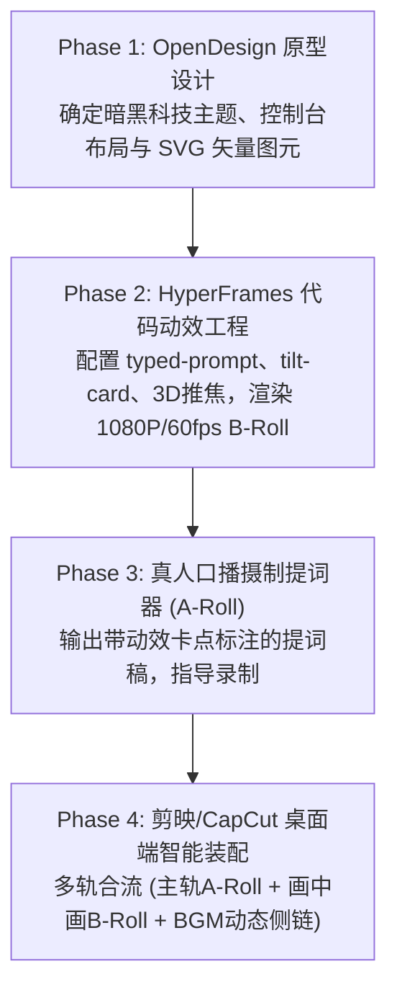

# hyper-presenter-studio Skill

专为**“极客真人口播 + 纯代码科技动效 + 剪映桌面端自动化”**打造的 Agent 协同制作规范。

当用户提出想要制作“真人口播科技视频”、“CLI / 开发者工具安装演示”、“带代码动效的真人宣传片”时，智能体激活本 Skill，并严格遵循 4 阶段推进：

---

## 🛠️ 四阶段智能体执行规约 (Execution Protocol)

### Phase 1：原型构建与资产沉淀 (`01_prototype_opendesign/`)
1. **引导用户明确原型范围**：
   - 目标展示的终端（Terminal）命令、输出结果、Web 控制台截图或架构拓扑。
2. **沉淀设计资产**：
   - 在 `01_prototype_opendesign/assets/` 下整理 SVG 图标、终端配色方案（如 Catppuccin Mocha, Cyber Neon）。
   - 确立统一的 Canvas 分辨率：**1920 × 1080**。

### Phase 2：HyperFrames 动效渲染 (`02_motion_hyperframes/`)
1. **调用 HyperFrames CLI 工具链**：
   - 配置 `typed-prompt`（人类真实敲击延迟 `typingSpeed: 0.08s`，含光标闪烁）；
   - 启用 `yt-camera-move` 与 `tilt-card`（当回车触发执行时，施加微距前推与 3D 浮动）；
   - 叠加 `yt-screen-warp`（边缘微妙扫描线与暗角，营造物理显示器质感）。
2. **渲染产物规范**：
   - 全屏插片：渲染为 `output/broll_motion.mp4`（1080P / 60fps）；
   - 浮动层：渲染为 `output/broll_overlay.webm`（带 Alpha 透明通道）。

### Phase 3：真人口播提词与节拍设计 (`03_presenter_aroll/`)
1. **输出导演级提词稿**：
   - 在每句话后方明确标注【视觉动作】（如：`[全屏切入终端敲击]`、`[右侧弹出悬浮卡片]`、`[人物微缩至左下角]`）；
2. **网感气口法则**：
   - 每段口播不超过 15~20 个字，单幕不超过 4 秒必须有视觉动作刺激。

### Phase 4：剪映 / CapCut 自动化装配 (`04_assembly_capcut/`)
1. **执行自动化脚本**：
   - 运行 `python 04_assembly_capcut/assemble_draft.py`；
   - 自动生成剪映本地草稿工程目录；
   - 铺设三层轨道：
     - **Track 1（主视频轨）**：真人 A-Roll 实拍素材；
     - **Track 2（画中画轨）**：HyperFrames 导出的 1080P B-Roll；
     - **Track 3（音频轨）**：Future Bass / Cyber Tech 律动 BGM；
2. **交付用户**：
   - 告知用户草稿已建立，打开剪映即可看到已对齐的多轨时间线，直接进行鼠标微调与一键导出。
