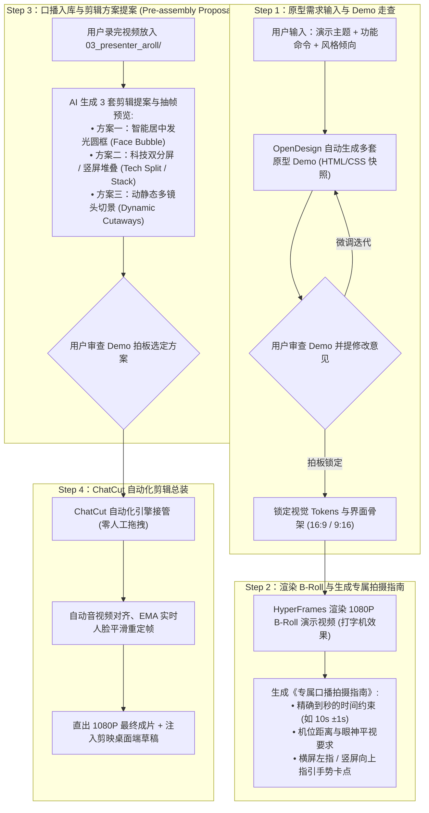

# 📋 极客真人口播视频全流程实操 SOP (Interactive Studio SOP)

> **定位**：面向技术开发者与科技博主的 1080P 极客网感口播视频保姆级落地指南。  
> **双画幅支持**：全面覆盖 **16:9 横屏极客大片** 与 **9:16 移动端社交爆款 (Social Stack)**。  
> **核心模式**：**用户只需提需求与拍口播，AI 全程承包“原型Demo、拍摄脚本、剪辑提案与 ChatCut 自动出片”**。

---

## 🔄 四步人机协同工作流 (The 4-Step Co-Director Flow)



---

## 阶段一：OpenDesign UI 原型与视觉提案 (Step 1: Prototype)

### 1. 运行原型生成器
只要用户给出演示视频的主要内容、功能命令与风格要求，运行：
```bash
# 生成全套主题（横屏 16:9 + 竖屏 9:16 移动端卡片）
npm run proto:generate

# 仅生成竖屏 9:16 原型
npm run proto:generate:vertical
```
也可以指定参数：
```bash
python 01_prototype_opendesign/generate_prototype.py --title "Reasonix CLI" --command "npm install -g reasonix" --theme cyber-dark --ratio 9:16
```

### 2. 用户审查与微调
1. 浏览器打开 `01_prototype_opendesign/prototype_cyber-dark.html`（横屏）或 `prototype_cyber-dark_9x16.html`（竖屏），查看高保真动态网页原型；
2. 用户提出修改意见（如：“窗口阴影淡一点”、“主色调换成极客绿”）；
3. AI 快速修改并更新原型，用户拍板后锁定设计 Token。

---

## 阶段二：演示视频渲染与专属拍摄指南 (Step 2: Motion & Shooting Guide)

### 1. 渲染 1080P 演示 B-Roll
```bash
npm run hyperframes:render
```
将 OpenDesign 原型编译为广播级 1080P 60fps 演示视频（存储至 `output/broll_motion.mp4`）。

### 2. 生成专属口播拍摄指南
```bash
# 生成横竖屏两套完整拍摄指南与提词卡
npm run guide:generate
```
脚本将严格根据 B-Roll 的精确时长，生成配套指南：
- **横屏参考**：[CURRENT_SHOOTING_GUIDE.md](file:///d:/video/视频3/hyper-presenter-studio/03_presenter_aroll/CURRENT_SHOOTING_GUIDE.md)
  - 肢体手势：食指指向左侧终端演示窗口；
  - 构图：半身出镜，眼神对齐上 1/3 水平线。
- **竖屏参考**：[CURRENT_SHOOTING_GUIDE_9x16.md](file:///d:/video/视频3/hyper-presenter-studio/03_presenter_aroll/CURRENT_SHOOTING_GUIDE_9x16.md)
  - 肢体手势：**食指向上指引**上方浮动的终端卡片；
  - 构图：留出顶部 15% 与底部 20% 平台交互遮挡安全区。

---

## 阶段三：素材入库与剪辑方案提案 (Step 3: Proposals & Review)

用户将录制好的视频放入 `03_presenter_aroll/`（如 `presenter.mp4`）。

在正式剪辑前，**先给用户呈递剪辑方案提案与 Demo 抽帧预览**：
```bash
# 横屏 16:9 提案审查
npm run edit:propose

# 竖屏 9:16 提案审查
npm run edit:propose:vertical

# 同时生成全画幅提案
npm run edit:propose:all
```
该命令会自动嗅探素材，并在 `output/EDITING_PROPOSAL.md` 或 `output/EDITING_PROPOSAL_9X16.md` 中输出 3 套方案的**镜头规划、融合方式与抽帧 Demo**：
1. **方案一 (发光圆框 · Face Bubble)**：B-Roll 占满全屏，右下角带有 `#38bdf8` 发光能量环的人脸气泡，采用 EMA 实时平滑追踪居中；
2. **方案二 (科技双分屏 / 竖屏堆叠 · Tech Split / Stack)**：
   - 16:9：左侧 1200×675 演示 + 右侧 544×960 真人；
   - 9:16：上半屏 1000×562 浮动终端卡片 + 下半屏 1080×1080 真人口播；
3. **方案三 (多镜头智能切景 · Dynamic Cutaways)**：Shot 1 真人近景 Hook ➔ Shot 2 发光圆框代码流 ➔ Shot 3 分屏/堆叠定格。

---

## 阶段四：ChatCut 自动化总装出片 (Step 4: Autonomous Assembly)

用户拍板方案后，无需手动拖拽剪辑，终端一条指令出片并自动注册剪映桌面端草稿：

### 🖥️ 横屏 16:9 成片：
```bash
npm run assemble:bubble   # 方案一：发光圆框
npm run assemble:split    # 方案二：左右双分屏
npm run assemble:dynamic  # 方案三：动态切景
npm run assemble          # 一键出片全部 3 种
```

### 📱 竖屏 9:16 移动端成片：
```bash
npm run assemble:vertical:bubble   # 方案一：移动端发光圆框
npm run assemble:vertical:stack    # 方案二：社交卡片上下堆叠 (Social Stack)
npm run assemble:vertical:dynamic  # 方案三：竖屏动态切景
npm run assemble:vertical          # 一键出片全部竖屏版本
```

### 自动化总装执行结果：
1. **自动物理合成**：基于 OpenCV 实时人脸追踪与 FFmpeg Lanczos4 抗锯齿合成，直出最终成品视频至 `output/`；
2. **自动注入剪映/CapCut 桌面端**：直接在剪映本地草稿库构建工程，并自动更新 `root_meta_info.json` 索引库，打开剪映即可在最近项目中看到置顶草稿！
